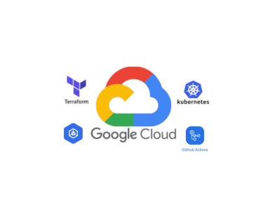

# Luiza Labs - Challenge

Este arquivo tem como objetivo listar sobre a construção do desafio.

## Proposta Solicitada:

1. Provisionar um cluster Kubernetes, via código IaC, em um cloud provider de sua escolha (conta nível grátis).
    - **Cloud Provider Escolhido**: GCP
2. Realizar o deploy de uma aplicação "HelloWorld" neste cluster, via pipelines de CI/CD (ferramentas a sua escolha).
    - **CI/CD escolhido**: GitHub Actions

### Plus da Proposta:

- Provisionar o cluster também via pipeline (GitOps)
- Setup de monitoramento básico da Aplicação provisionada e do cluster - Lens

---

## Estrutura de diretórios

### .github/workflows

**Descrição**: Este diretório é utilizado para armazenar os arquivos de configuração dos workflows do GitHub Actions.

**Conteúdo**: Aqui você encontra arquivos YAML (.yml) que definem os pipelines de CI/CD. Por exemplo, um arquivo chamado `deploy.yml` contém instruções para testar, construir e implantar a aplicação automaticamente.

### .terraform/providers/registry.terraform.io/hashicorp/google/5.35.0/windows_386

**Descrição**: Este caminho refere-se à estrutura interna que o Terraform cria para armazenar os plugins dos provedores que ele utiliza, neste caso, o provedor do Google Cloud.

**Conteúdo**: Aqui você encontra os binários do provedor do Google Cloud (versão 5.35.0) para a arquitetura Windows 386. Estes binários são utilizados pelo Terraform para interagir com a Google Cloud Platform.

### terraform-gke

**Descrição**: Este diretório contém os arquivos de configuração do Terraform.

**Conteúdo**: Aqui existe a definição dos recursos relacionados ao Google Kubernetes Engine (GKE), como clusters, nós e outros recursos do Kubernetes no Google Cloud.

### app

**Descrição**: Este diretório é utilizado para armazenar o código-fonte da aplicação.

**Conteúdo**: Contém o arquivo `deployment.yaml` que define a configuração do deployment da nossa aplicação hello-world.

### .terraform.lock.hcl

**Descrição**: Este é um arquivo de bloqueio do Terraform.

**Conteúdo**: Contém as versões dos provedores que foram utilizados na última execução do `terraform init`. Isso garante que as mesmas versões sejam utilizadas em futuras execuções para manter a consistência.

---