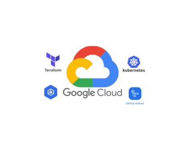

# Luiza Labs - Challenge

Este arquivo tem como objetivo listar sobre a construção do desafio.

## Proposta Solicitada:

1. Provisionar um cluster Kubernetes, via código IaC, em um cloud provider de sua escolha (conta nível grátis).
    - **Cloud Provider Escolhido**: GCP
2. Realizar o deploy de uma aplicação "HelloWorld" neste cluster, via pipelines de CI/CD (ferramentas a sua escolha).
    - **CI/CD escolhido**: GitHub Actions

### Plus da Proposta:

- Provisionar o cluster também via pipeline (GitOps)
- Setup de monitoramento básico da Aplicação provisionada e do cluster - Lens

---

### [Para mais detalhes do que foi feito no projeto consulte a documentação aqui](docs/README.md)